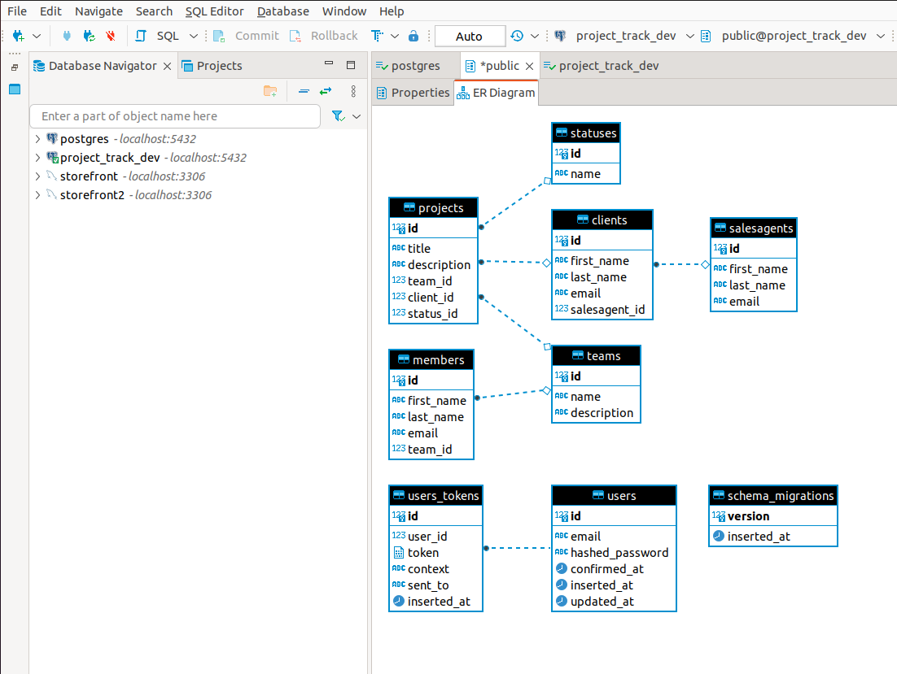

# ProjectTrack

This is a simple app to demostrate relational database and CRUD (Create, Retrieve, Update and Delete).

To start your Phoenix server:

  * Install dependencies with `mix deps.get`
  * Create and migrate your database with `mix ecto.setup`
  * Start Phoenix endpoint with `mix phx.server` or inside IEx with `iex -S mix phx.server`
  
To populate tables such as Sales Agent, Team and Status with dummy data:
	
  * Populate with `mix run priv/repo/seeds.exs`

Now you can visit [`localhost:4000`](http://localhost:4000) from your browser.

Ready to run in production? Please [check our deployment guides](https://hexdocs.pm/phoenix/deployment.html).

## Screenshot

